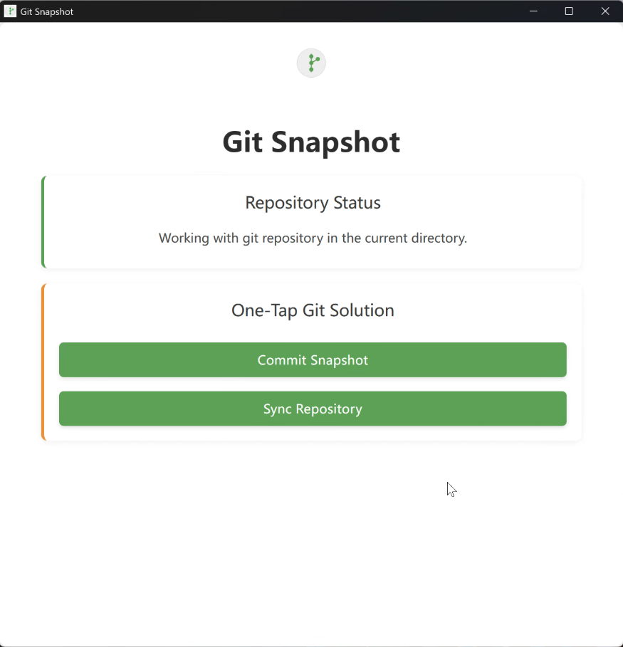

+++
date = '2025-07-01T00:00:00-00:00'
draft = false
title = 'Git Snapshot Tool'
+++

## GitHub
[https://github.com/lihaozhe013/git-snapshot-tauri](https://github.com/lihaozhe013/git-snapshot-tauri)

## Project Description
This is a Rust based git snapshot tool that can auto fetch, pull, commit and push markdown notes to github with one click, enabled users unfamiliar with Git to quickly commit Markdown notes to GitHub with commit
history

## Screenshots

