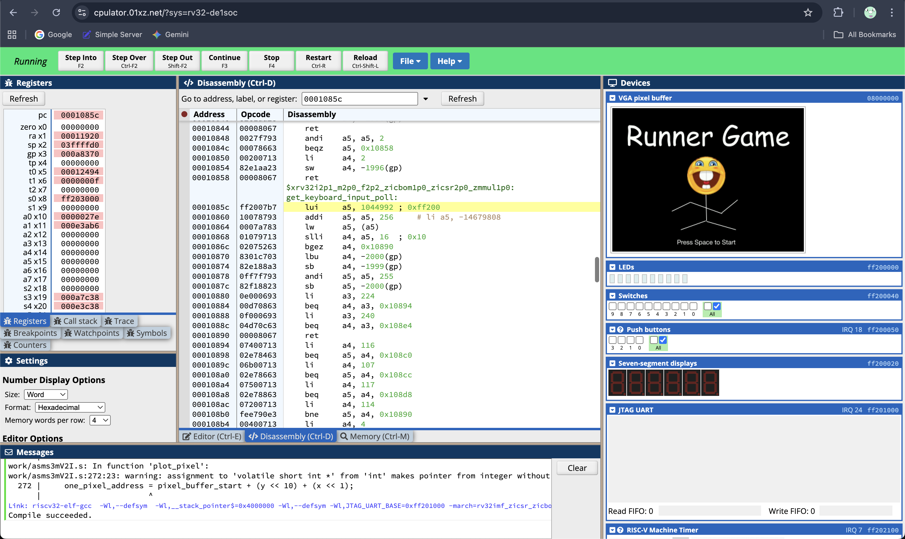

+++
date = '2025-04-03T00:00:00-00:00'
draft = false
title = 'Runner Game'
+++

This is my ECE243 course project.

## GitHub
[https://github.com/lihaozhe013/ece243_runner_game](https://github.com/lihaozhe013/ece243_runner_game)

## Game Description
User controls a sprite in person perspective using a PS/2 keyboard to dodge the obstacles. There will be multiple lanes with obstacles or power-ups (like a shield) spawning randomly. A point system will be displayed on the screen. The sprite will "run" faster as time goes on (so it will be harder to dodge obstacles) and when the user hits an obstacle it will be game over, an audio clip will be played, and the final score will be displayed.

## Hardware

- DE1-SoC FPGA Board
- PS/2 Keyboard
- Speakers

 

## How to play the game

1. Needs the PS/2 keyboard, a monitor for display, and speaker for audio
2. To start, press the space bar
3. Start with 3 lives, dodge the obstacles for as long as you can using the arrow keys to move up, down, left, or right
4. To restart the game (from the game over screen), press the space bar

 

## Attribution Table

| Task                                                         | Mainly Assigned to  | Modification     |
| ------------------------------------------------------------ | ------------------- | ---------------- |
| Main Game Logic including 1. Generation of obstacles at random position & obstacles movement 2. Player movement 3. Collision 4. Score system | Haozhe              | Haozhe & Wilbert           |
| VGA things including 1. Visualization of **background** 2. Visualization of **player character** (including animation) and **obstacles** 3. Clear elements without clearing the whole screen 4. **Start Page** and **Game Over Page** display | Haozhe              | Haozhe           |
| HP system + soap system (Note: soap system was removed in final project due to unfixable bug) | Haozhe & Wilbert    | Haozhe & Wilbert |
| Visualization of **Score** and **HP**                        | Wilbert             | Wilbert          |
| Sound effect including 1. Colliding obstacles 2. Game Over sound 3. Colliding soap sound (Removed in the final project) | Wilbert             | Wilbert & Haozhe |
| PS/2 Keyboard (Polling)                                      | Wilbert             | Wilbert          |
| Debugging and Bug fixing     
## Screenshots

## Video
<iframe width="560" height="315" src="https://www.youtube.com/embed/RQi18sazYOA?si=xa4A9LQmX19ti3yc" title="YouTube video player" frameborder="0" allow="accelerometer; autoplay; clipboard-write; encrypted-media; gyroscope; picture-in-picture; web-share" referrerpolicy="strict-origin-when-cross-origin" allowfullscreen></iframe>