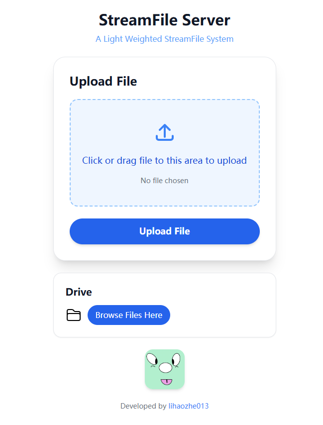
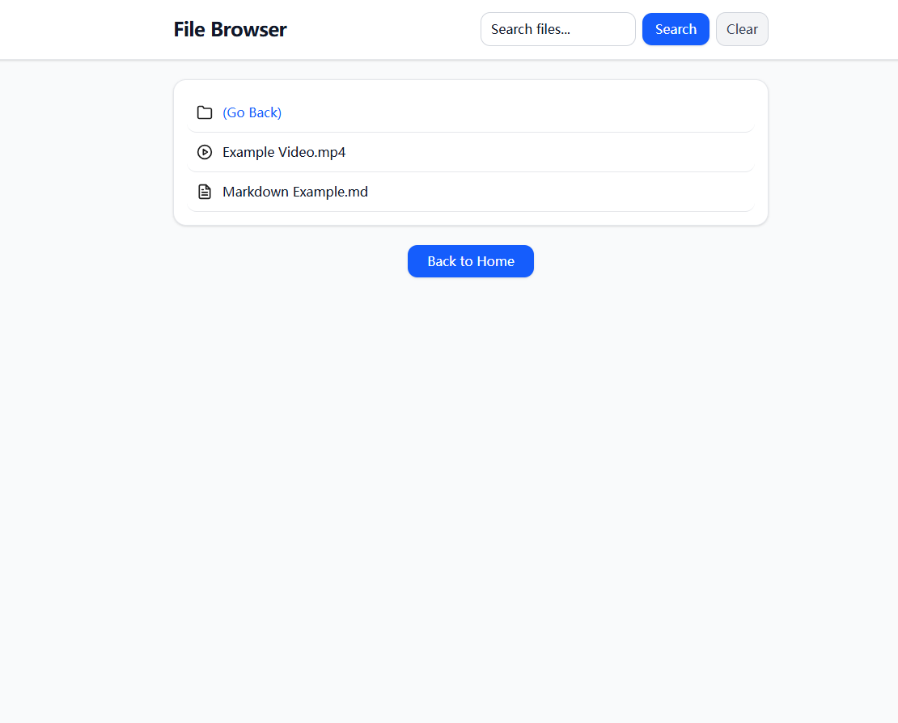
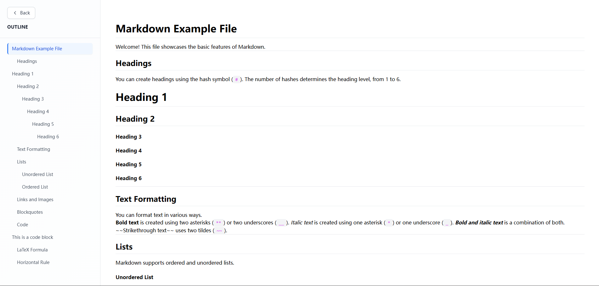
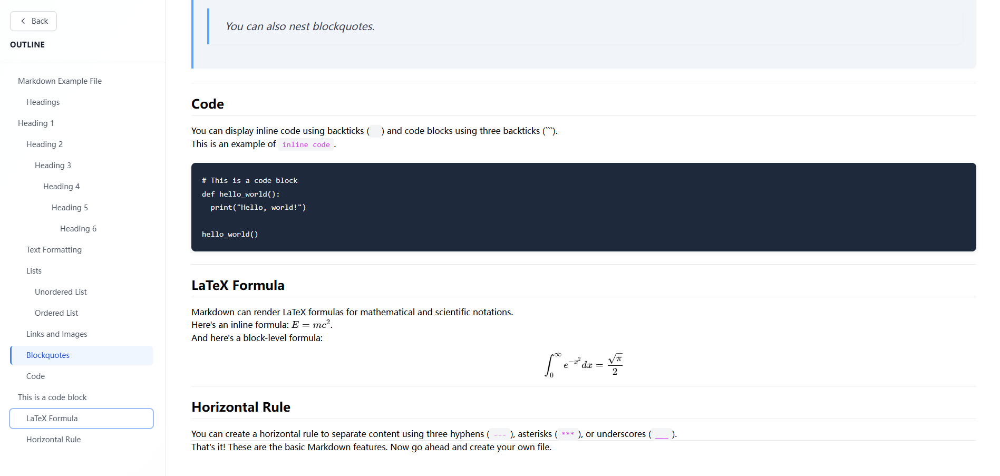
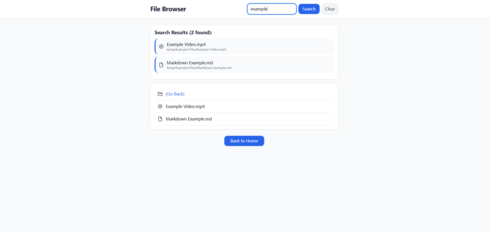

+++
date = '2025-09-13T00:00:00-00:00'
draft = false
title = 'StreamFile Server'
+++

## GitHub
Latest Version: [https://github.com/lihaozhe013/streamfile-server-go](https://github.com/lihaozhe013/streamfile-server-go)

Node.js Version (Old): [https://github.com/lihaozhe013/streamfile-server-nodejs](https://github.com/lihaozhe013/streamfile-server-nodejs)

## Screenshots













## Features

**Search**

Users can search for files in the current directory and its subdirectories.

**File Upload**

User can upload files to the server, the uploaded files are not visible to other users and will only be released after permission is granted.

**Video Player**

A video player build by video.js.

**Markdown Rendering**

Markdown Content will be rendered.

**Log**

Can be enabled in config.yaml.

<br>

## Project Specifications
- Vite + React.js for markdown-viewer
- Plain HTML + JavaScript for file-browser and video-player, this is to accommodate very old devices and reduce loading times caused by VDOM.
- Build Scripts are based on Node.js fs-extra
- The project was initially developed using the Node.js Express framework and has now been rebuilt as a Go-based backend system.

<br>

## Tech Stack

**Backend**
- Go
- Gin

<br>

**Frontend**
- TypeScript
- React
- React Router
- Video.js


## License

MIT License.

## Example Config File
```yaml
server:
  host: "0.0.0.0"
  port: 8000
  readTimeout: 30s
  writeTimeout: 30s

storage:
  uploadDir: "./files"
  incomingDir: "./files/incoming"
  privateDir: "./files/private-files"
  maxUploadSize: 10737418240  # 10GB

security:
  allowedExtensions:
    - ".jpg"
    - ".jpeg"
    - ".png"
    - ".gif"
    - ".pdf"
    - ".md"
    - ".txt"
    - ".html"
    - ".css"
    - ".js"
    - ".zip"
    - ".tar"
    - ".gz"
    - ".7z"
    - ".svg"
    - ".mp4"
    - ".mov"
    - ".mp3"
    - ".docx"
    - ".xlsx"
    - ".pptx"
    - ".rtf"
    - ".db"
  blockedPaths:
    - "incoming"
    - "private-files"

logging:
  enabled: true        # Log switch. If set to false, logging is completely disabled.
  level: "info"        # Log level: debug, info, warn, error
  format: "json"       # Log format: json, text
  toFile: false        # Whether output to a file instead of the console
  logDir: "./logs"     # Log file directory (effective when `toFile` is true)
```