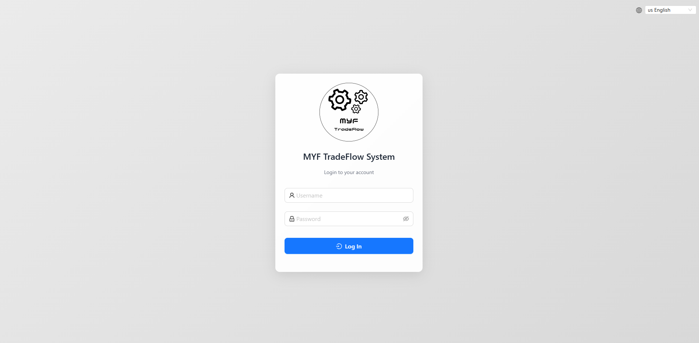
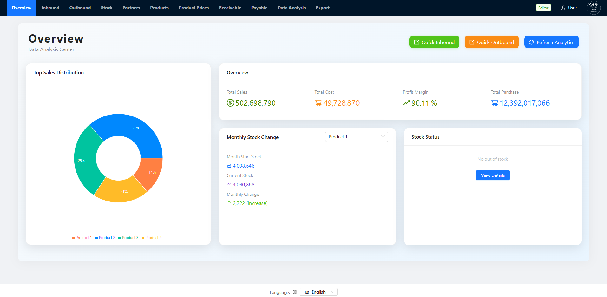
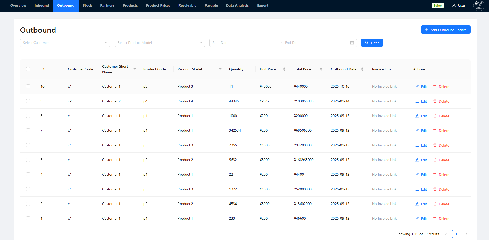
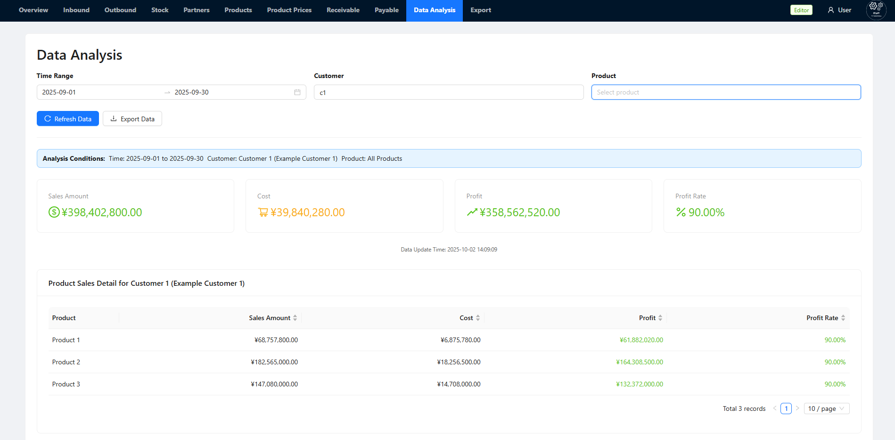
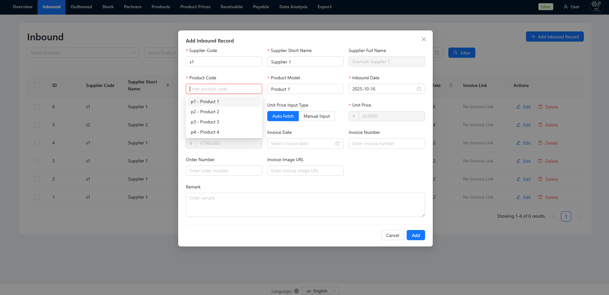
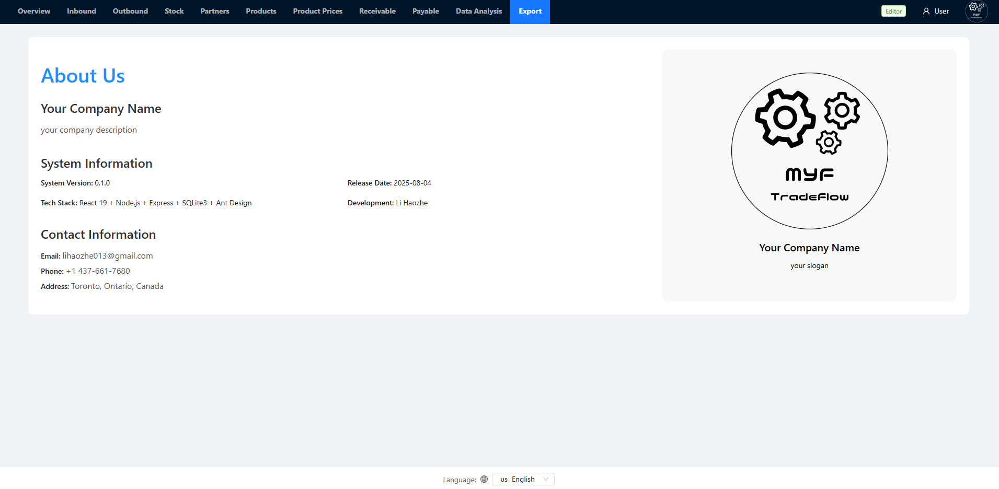
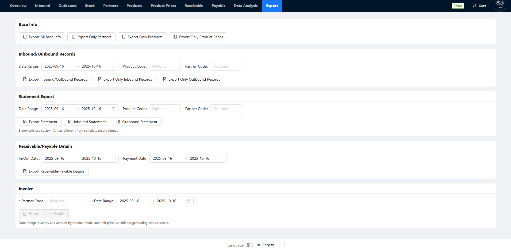

+++
date = '2025-09-13T00:00:00-00:00'
draft = false
title = 'TradeFlow System'
+++

## [GitHub](https://github.com/lihaozhe013/myf-tradeflow-core)
## [Demo (Click Me)](https://haozheliexampleproject.xyz)

**Use the following username and password in the demo**:
<br>
**Username**: user; **Password**: Thisistheuserpassword
> The demo is my pre-production environment for testing use.

## Screenshots














## Features
### Language Support
English, Simplified Chinese, Korean

<br>

### Project Specifications
- TypeScript + ESM for both backend and frontend, strictly use typescript path aliases 
- Use ESBuild for backend compiling and bundling, but since it contains native libraries and libraries adhering to the CommonJS standard, node_modules is not bundled; Final backend artifact will be a single server.js file + node_modules
- Use Vite for frontend dev and build
- Auto reload (watch and rebuild) is enabled for both frontend and backend dev mode

<br>

### JWT Auth
Can be enabled in appConfig.json

**Example**
```json
"auth": {
    "enabled": true,
    "tokenExpiresInHours": 12,
    "loginRateLimit": {
      "windowMinutes": 5,
      "maxAttempts": 20
    },
    "allowExportsForReader": true
}
```
<br>

### Role Based Access Control & App Log
RBAC is automatically enabled when JWT Auth is activated, and the App Log (not Nginx's Access Log) records the username and operation ID for all database write operations (all POST interface operations).


## Tech Stack
### Backend
- TypeScript
- Node.js
- SQLite
<br>

### Frontend
- TypeScript
- Vite
- React
- React Router 
- React i18next
- AntD
<br>

### DevOps
- Docker
- GitHub Actions (not yet been open-sourced)

### Deployment
- AlmaLinux
- Ubuntu LTS
- Docker
- Nginx
- PM2

Successfully deployed on AWS Ubuntu LTS and AlmaLinux, using PM2 for concurrent requests handling, and Nginx Docker as a reverse proxy server. 

Starting from version v0.3.0, a Docker deployment solution has been adopted, both TradeFlow System and Nginx are deployed in Docker.

## License

MIT License.


## Example Config Files
**appConfig.json**
```json
{
  "paymentMethods": {
    "list": [
      "Cash",
      "E-Transfer",
      "Cheque",
      "Banker's acceptance",
      "Other"
    ],
    "default": "E-Transfer",
    "config": {
      "cash": { "label": "Cash", "code": "CASH" },
      "bank_transfer": { "label": "E-Transfer", "code": "BANK_TRANSFER" },
      "check": { "label": "Cheque", "code": "CHECK" },
      "bank_acceptance": { "label": "Banker's acceptance", "code": "BANK_ACCEPTANCE" },
      "other": { "label": "Other", "code": "OTHER" }
    }
  },
  "productCategories": {
    "list": [
        "category 1",
        "category 2",
        "category 3",
        "Other"
    ],
    "default": "Other"
  },
  "auth": {
    "enabled": true,
    "tokenExpiresInHours": 12,
    "loginRateLimit": {
      "windowMinutes": 5,
      "maxAttempts": 20
    },
    "allowExportsForReader": true
  },
  "server": {
    "httpPort": 8080
  },
  "frontend": {
    "hostByBackend": true,
    "distPath": "./frontend/dist",
    "fallbackToIndex": true
  }
}
```
<br>

**exportConfig.json**

```json
{
  "partners": {
    "sheetName": "Suppliers and Customers",
    "columns": [
      { "label": "Code", "key": "code" },
      { "label": "Short Name", "key": "short_name" },
      { "label": "Full Name", "key": "full_name" },
      { "label": "Type", "key": "type_name" },
      { "label": "Address", "key": "address" },
      { "label": "Contact Person", "key": "contact_person" },
      { "label": "Contact Phone", "key": "contact_phone" }
    ]
  },
  "products": {
    "sheetName": "Product Info",
    "columns": [
      { "label": "Code", "key": "code" },
      { "label": "Category", "key": "category" },
      { "label": "Product Model", "key": "product_model" },
      { "label": "Remark", "key": "remark" }
    ]
  },
  "prices": {
    "sheetName": "Product Prices",
    "columns": [
      { "label": "Partner Short Name", "key": "partner_short_name" },
      { "label": "Product Model", "key": "product_model" },
      { "label": "Effective Date", "key": "effective_date" },
      { "label": "Expiry Date", "key": "expiry_date" },
      { "label": "Unit Price", "key": "unit_price" }
    ]
  },
  "inbound": {
    "sheetName": "Inbound Records",
    "columns": [
      { "label": "Inbound Date", "key": "inbound_date" },
      { "label": "Supplier Code", "key": "supplier_code" },
      { "label": "Supplier Short Name", "key": "supplier_short_name" },
      { "label": "Product Code", "key": "product_code" },
      { "label": "Product Model", "key": "product_model" },
      { "label": "Quantity", "key": "quantity" },
      { "label": "Unit Price", "key": "unit_price" },
      { "label": "Total Price", "key": "total_price" }
    ]
  },
  "outbound": {
    "sheetName": "Outbound Records",
    "columns": [
      { "label": "Outbound Date", "key": "outbound_date" },
      { "label": "Invoice Number", "key": "invoice_number" },
      { "label": "Customer Code", "key": "customer_code" },
      { "label": "Customer Short Name", "key": "customer_short_name" },
      { "label": "Product Code", "key": "product_code" },
      { "label": "Product Model", "key": "product_model" },
      { "label": "Quantity", "key": "quantity" },
      { "label": "Unit Price", "key": "unit_price" },
      { "label": "Total Price", "key": "total_price" },
      { "label": "Order Number", "key": "order_number" }
    ]
  },
  "receivable_summary": {
    "sheetName": "Receivable Summary",
    "columns": [
      { "label": "Customer Code", "key": "customer_code" },
      { "label": "Customer Short Name", "key": "customer_short_name" },
      { "label": "Customer Full Name", "key": "customer_full_name" },
      { "label": "Total Sales", "key": "total_sales" },
      { "label": "Total Payments", "key": "total_payments" },
      { "label": "Balance", "key": "balance" }
    ]
  },
  "receivable_details": {
    "sheetName": "Receivable Details",
    "columns": [
      { "label": "Outbound Record ID", "key": "record_id" },
      { "label": "Customer Code", "key": "customer_code" },
      { "label": "Customer Short Name", "key": "customer_short_name" },
      { "label": "Product Model", "key": "product_model" },
      { "label": "Total Price", "key": "total_price" },
      { "label": "Outbound Date", "key": "outbound_date" },
      { "label": "Remark", "key": "remark" }
    ]
  },
  "receivable_payments": {
    "sheetName": "Receivable Payments",
    "columns": [
      { "label": "Payment ID", "key": "id" },
      { "label": "Customer Code", "key": "customer_code" },
      { "label": "Payment Amount", "key": "amount" },
      { "label": "Payment Date", "key": "pay_date" },
      { "label": "Payment Method", "key": "pay_method" },
      { "label": "Remark", "key": "remark" }
    ]
  },
  "payable_summary": {
    "sheetName": "Payable Summary",
    "columns": [
      { "label": "Supplier Full Name", "key": "supplier_full_name" },
      { "label": "Total Purchases", "key": "total_purchases" },
      { "label": "Total Payments", "key": "total_payments" },
      { "label": "Balance", "key": "balance" }
    ]
  },
  "payable_details": {
    "sheetName": "Payable Details",
    "columns": [
      { "label": "Inbound Record ID", "key": "record_id" },
      { "label": "Supplier Short Name", "key": "supplier_short_name" },
      { "label": "Product Model", "key": "product_model" },
      { "label": "Total Price", "key": "total_price" },
      { "label": "Inbound Date", "key": "inbound_date" },
      { "label": "Remark", "key": "remark" }
    ]
  },
  "payable_payments": {
    "sheetName": "Payable Payments",
    "columns": [
      { "label": "Payment ID", "key": "id" },
      { "label": "Supplier Code", "key": "supplier_code" },
      { "label": "Payment Amount", "key": "amount" },
      { "label": "Payment Date", "key": "pay_date" },
      { "label": "Payment Method", "key": "pay_method" },
      { "label": "Remark", "key": "remark" }
    ]
  },
  "invoice": {
    "sheetName": "Invoice Details",
    "columns": [
      { "label": "Product Model", "key": "product_model" },
      { "label": "Quantity", "key": "quantity" },
      { "label": "Unit Price", "key": "unit_price" },
      { "label": "Total Price", "key": "total_price" }
    ]
  },
  "inbound_statement": {
    "sheetName": "Inbound Records",
    "columns": [
      { "label": "Inbound Date", "key": "inbound_date" },
      { "label": "Order Number", "key": "order_number" },
      { "label": "Supplier Full Name", "key": "supplier_full_name" },
      { "label": "Product Model", "key": "product_model" },
      { "label": "Quantity", "key": "quantity" },
      { "label": "Unit Price", "key": "unit_price" },
      { "label": "Total Price", "key": "total_price" },
      { "label": "Invoice Number", "key": "invoice_number" }
    ]
  },
  "outbound_statement": {
    "sheetName": "Outbound Records",
    "columns": [
      { "label": "Outbound Date", "key": "outbound_date" },
      { "label": "Order Number", "key": "order_number" },
      { "label": "Customer Full Name", "key": "customer_full_name" },
      { "label": "Product Model", "key": "product_model" },
      { "label": "Quantity", "key": "quantity" },
      { "label": "Unit Price", "key": "unit_price" },
      { "label": "Total Price", "key": "total_price" },
      { "label": "Invoice Number", "key": "invoice_number" }
    ]
  },
  "analysis_summary": {
    "sheetName": "数据分析汇总",
    "columns": [
      { "label": "Analysis Item", "key": "metric_name" },
      { "label": "Amount", "key": "amount" },
      { "label": "Remark", "key": "remark" }
    ]
  },
  "analysis_detail": {
    "sheetName": "Detailed Analysis",
    "columns": [
      { "label": "Customer Code", "key": "customer_code" },
      { "label": "Customer Name", "key": "customer_name" },
      { "label": "Product Model", "key": "product_model" },
      { "label": "Sales Amount", "key": "sales_amount" },
      { "label": "Cost", "key": "cost_amount" },
      { "label": "Profit", "key": "profit_amount" },
      { "label": "Profit Margin (%)", "key": "profit_rate" }
    ]
  },
  "analysis_customer_summary": {
    "sheetName": "Customer Sales Summary",
    "columns": [
      { "label": "Customer Code", "key": "customer_code" },
      { "label": "Customer Name", "key": "customer_name" },
      { "label": "Sales Amount", "key": "sales_amount" },
      { "label": "Cost", "key": "cost_amount" },
      { "label": "Profit", "key": "profit_amount" },
      { "label": "Profit Margin (%)", "key": "profit_rate" }
    ]
  },
  "analysis_customer_detail": {
    "sheetName": "Product Sales Detail",
    "columns": [
      { "label": "Product Model", "key": "product_model" },
      { "label": "Sales Amount", "key": "sales_amount" },
      { "label": "Cost", "key": "cost_amount" },
      { "label": "Profit", "key": "profit_amount" },
      { "label": "Profit Margin (%)", "key": "profit_rate" }
    ]
  },
  "analysis_product_summary": {
    "sheetName": "Product Sales Summary",
    "columns": [
      { "label": "Product Model", "key": "product_model" },
      { "label": "Sales Amount", "key": "sales_amount" },
      { "label": "Cost", "key": "cost_amount" },
      { "label": "Profit", "key": "profit_amount" },
      { "label": "Profit Margin (%)", "key": "profit_rate" }
    ]
  },
  "analysis_product_detail": {
    "sheetName": "Customer Sales Detail",
    "columns": [
      { "label": "Customer Code", "key": "customer_code" },
      { "label": "Customer Name", "key": "customer_name" },
      { "label": "Sales Amount", "key": "sales_amount" },
      { "label": "Cost", "key": "cost_amount" },
      { "label": "Profit", "key": "profit_amount" },
      { "label": "Profit Margin (%)", "key": "profit_rate" }
    ]
  },
  "analysis_detail_by_product": {
    "sheetName": "Product Analysis",
    "columns": [
      { "label": "Product Model", "key": "product_model" },
      { "label": "Sales Amount", "key": "sales_amount" },
      { "label": "Cost", "key": "cost_amount" },
      { "label": "Profit", "key": "profit_amount" },
      { "label": "Profit Margin (%)", "key": "profit_rate" }
    ]
  },
  "analysis_detail_by_customer": {
    "sheetName": "Customer Analysis",
    "columns": [
      { "label": "Customer Code", "key": "customer_code" },
      { "label": "Customer Name", "key": "customer_name" },
      { "label": "Sales Amount", "key": "sales_amount" },
      { "label": "Cost", "key": "cost_amount" },
      { "label": "Profit", "key": "profit_amount" },
      { "label": "Profit Margin (%)", "key": "profit_rate" }
    ]
  }
}
```
<br>

**about.json**

```json
{
  "title": "About Us",
  "company": {
    "name": "Your Company Name",
    "description": "your company description",
    "slogan": "your slogan"
  },
  "system": {
    "version": "0.1.0",
    "releaseDate": "2025-08-04",
    "techStack": "React 19 + Node.js + Express + SQLite3 + Ant Design",
    "team": "Li Haozhe"
  },
  "contact": {
    "email": "lihaozhe013@gmail.com",
    "phone": "+1 437-661-7680",
    "address": "Toronto, Ontario, Canada"
  },
  "lastUpdated": "2025-08-04T10:30:00.000Z"
}

```